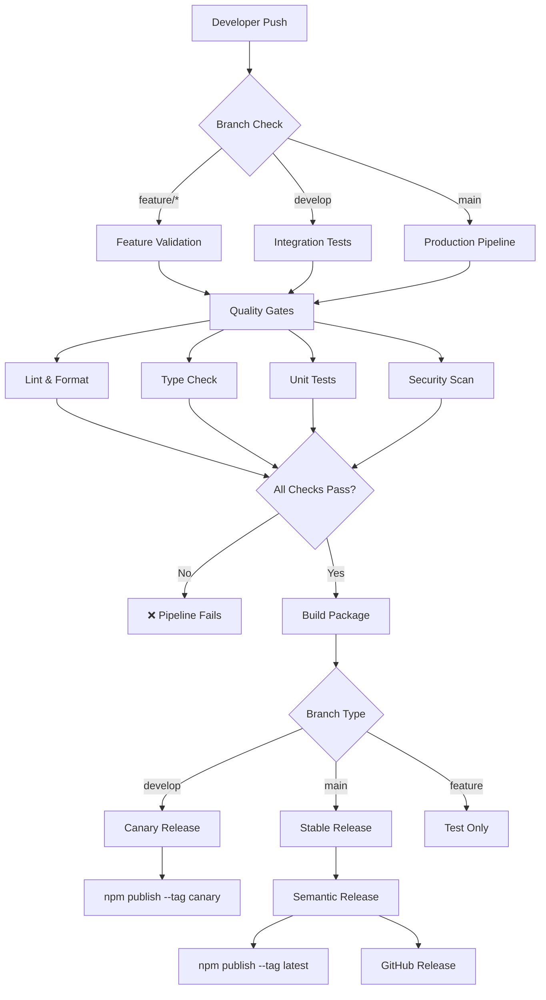

# CI/CD Pipeline Documentation

This document describes the complete CI/CD pipeline setup for the Better Auth Apso Adapter package.

## Overview

Our CI/CD pipeline provides automated testing, building, and publishing with multiple quality gates and deployment strategies. The pipeline ensures code quality, security, and reliability before any code reaches production.

## Pipeline Architecture



## Workflows

### 1. Main CI/CD Pipeline (`ci-cd.yml`)

**Triggers:**
- Push to `main` or `develop` branches
- Pull requests to `main` or `develop` branches

**Jobs:**

#### Test Job (Matrix Strategy)
- **Node.js versions:** 18, 20, 22
- **Steps:**
  1. Checkout repository
  2. Setup Node.js with caching
  3. Install dependencies
  4. Run linting (`npm run lint`)
  5. Check formatting (`npm run format:check`)
  6. Type checking (`npm run typecheck`)
  7. Unit tests (`npm run test:unit`)
  8. Conformance tests (`npm run test:conformance`)
  9. Performance tests (`npm run test:performance`)
  10. Generate coverage report
  11. Upload to Codecov
  12. Build package
  13. Verify package contents

#### Security Job
- **Security audit:** `npm audit --audit-level=moderate`
- **CodeQL analysis:** GitHub's security scanning
- **Dependency scanning:** Automated security checks

#### Canary Publishing (develop branch)
- **Trigger:** Push to `develop` branch
- **Process:**
  1. Generate canary version with timestamp and commit hash
  2. Publish to npm with `canary` tag
  3. Comment on PR with installation instructions

#### Stable Publishing (main branch)
- **Trigger:** Push to `main` branch
- **Process:**
  1. Run semantic-release
  2. Generate version based on commit messages
  3. Publish to npm with `latest` tag
  4. Create GitHub release with changelog

### 2. Release Workflow (`release.yml`)

**Triggers:**
- Push of version tags (`v*`)

**Process:**
1. **Build verification:** Full test suite
2. **Version validation:** Ensure package.json matches tag
3. **Tarball creation:** `npm pack`
4. **GitHub release:** Create release with assets
5. **npm publishing:** Publish with appropriate tag
   - Stable versions: `latest` tag
   - Pre-releases: `beta` tag
6. **Documentation update:** Deploy docs (if configured)

### 3. Dependency Review (`dependency-review.yml`)

**Triggers:**
- Pull requests to `main` or `develop`

**Features:**
- **Security scanning:** Check for known vulnerabilities
- **License compatibility:** Ensure license compliance
- **Dependency analysis:** Review new dependencies
- **License reporting:** Generate comprehensive license report

### 4. Maintenance Workflow (`maintenance.yml`)

**Schedule:** Weekly (Sundays at 2 AM UTC)

**Tasks:**
- **Security audit:** Check for vulnerabilities
- **Health checks:** Verify package integrity
- **Performance benchmarks:** Track performance metrics
- **Repository cleanup:** Clean old workflow runs

### 5. Status Checks (`status-checks.yml`)

**Purpose:** Aggregate all check results for branch protection

**Features:**
- **Status aggregation:** Combine all check results
- **PR labeling:** Automatic labeling based on status
- **Branch protection:** Single check for merge requirements

## Quality Gates

All code must pass these quality gates:

### 1. Code Quality
- ✅ **ESLint:** Code quality and best practices
- ✅ **Prettier:** Consistent code formatting
- ✅ **TypeScript:** Strict type checking

### 2. Testing
- ✅ **Unit Tests:** >90% code coverage required
- ✅ **Conformance Tests:** Better Auth compatibility
- ✅ **Performance Tests:** Performance benchmarks
- ✅ **Integration Tests:** End-to-end validation

### 3. Security
- ✅ **Dependency Audit:** Check for vulnerabilities
- ✅ **CodeQL Analysis:** Static security analysis
- ✅ **License Check:** Ensure license compatibility

### 4. Build Verification
- ✅ **TypeScript Compilation:** Successful build
- ✅ **Package Validation:** Verify package contents
- ✅ **Import Testing:** Ensure package can be imported

## Deployment Strategy

### Branch-based Deployment

| Branch | Environment | npm Tag | Purpose |
|--------|-------------|---------|---------|
| `main` | Production | `latest` | Stable releases |
| `develop` | Staging | `canary` | Integration testing |
| `feature/*` | Development | N/A | Feature development |

### Version Management

We use **Semantic Versioning** with automatic version bumps:

- **Patch (1.0.1):** Bug fixes, documentation
- **Minor (1.1.0):** New features, non-breaking changes
- **Major (2.0.0):** Breaking changes

#### Commit Message Conventions

```bash
# Triggers PATCH release
fix: resolve authentication bug
docs: update API documentation
perf: improve query performance

# Triggers MINOR release  
feat: add OAuth2 provider support
feat: implement session management

# Triggers MAJOR release
feat!: redesign adapter configuration API
feat: remove deprecated methods

BREAKING CHANGE: Configuration object structure changed
```

## Publishing Process

### Automatic Publishing

1. **Code pushed to main/develop**
2. **All quality gates pass**
3. **Semantic-release analyzes commits**
4. **Version determined automatically**
5. **Package built and tested**
6. **Published to npm**
7. **GitHub release created**
8. **Changelog updated**

### Manual Publishing

```bash
# Create and push version tag
git tag -a v1.2.3 -m "Release v1.2.3"
git push origin v1.2.3

# Release workflow triggers automatically
```

## Environment Setup

### Required Secrets

Configure these secrets in GitHub repository settings:

| Secret | Purpose | Required |
|--------|---------|----------|
| `NPM_TOKEN` | npm registry authentication | ✅ Yes |
| `GITHUB_TOKEN` | GitHub API access | ✅ Auto-provided |

### NPM Token Setup

1. **Create npm account** (if needed)
2. **Generate access token:**
   ```bash
   npm login
   npm token create --read-only=false
   ```
3. **Add to GitHub secrets** with name `NPM_TOKEN`

### Branch Protection Rules

Configure these rules for `main` branch:

- ✅ Require pull request reviews
- ✅ Require status checks to pass
- ✅ Require branches to be up to date
- ✅ Include administrators
- ✅ Restrict pushes

Required status checks:
- `test (18)`
- `test (20)` 
- `test (22)`
- `security`
- `dependency-review`

## Monitoring and Notifications

### Status Badges

Our README includes these badges:
- **Build Status:** CI/CD pipeline status
- **Coverage:** Test coverage percentage
- **npm Version:** Current published version
- **Downloads:** Monthly download count
- **License:** MIT license badge

### Notifications

- **Slack/Discord:** Pipeline status updates
- **Email:** Security vulnerabilities
- **GitHub Issues:** Automatic issue creation for failures
- **PR Comments:** Canary version information

## Troubleshooting

### Common Issues

#### 1. Tests Failing in CI but Pass Locally

**Cause:** Environment differences

**Solution:**
```bash
# Run CI simulation locally
./scripts/test-ci-locally.sh

# Use exact Node.js version as CI
nvm use 20
npm ci  # Use exact dependencies
npm test
```

#### 2. Publishing Fails

**Cause:** npm token issues or version conflicts

**Solutions:**
- Check `NPM_TOKEN` secret is valid
- Verify package name is available
- Check for version conflicts

#### 3. Security Audit Failures

**Cause:** Vulnerable dependencies

**Solutions:**
```bash
# Check vulnerabilities
npm audit

# Auto-fix if possible
npm audit fix

# Manual updates
npm update
```

#### 4. Build Failures

**Cause:** TypeScript compilation errors

**Solutions:**
```bash
# Check types locally
npm run typecheck

# Clean build
npm run clean
npm run build
```

## Performance Optimization

### Build Speed
- **Dependency caching:** npm cache in workflows
- **Incremental builds:** TypeScript incremental compilation
- **Parallel jobs:** Matrix testing strategy
- **Selective testing:** Run only affected tests

### Pipeline Efficiency
- **Job parallelization:** Run independent jobs simultaneously
- **Conditional execution:** Skip unnecessary steps
- **Resource optimization:** Use appropriate runner sizes
- **Cache strategies:** Cache node_modules and build artifacts

## Future Enhancements

### Planned Improvements
- **Multi-environment testing:** Test against different APIs
- **Visual regression testing:** UI component testing
- **Performance monitoring:** Track metrics over time
- **Automated security updates:** Dependabot integration
- **Canary analysis:** Automated rollback on failures

### Integration Opportunities
- **Sonar Cloud:** Code quality analysis
- **Snyk:** Security vulnerability scanning  
- **Lighthouse CI:** Performance monitoring
- **Bundle analyzer:** Track bundle size changes

## Best Practices

### For Developers
1. **Run local CI simulation** before pushing
2. **Follow conventional commits** for proper versioning
3. **Keep PRs small** for faster reviews
4. **Update tests** with code changes
5. **Document breaking changes** properly

### For Maintainers
1. **Review dependency updates** regularly
2. **Monitor security alerts** promptly
3. **Update CI workflows** as needed
4. **Maintain branch protection** rules
5. **Keep secrets secure** and rotated

## Support

For CI/CD related questions:
- **Documentation Issues:** Create GitHub issue
- **Pipeline Failures:** Check workflow logs
- **Security Concerns:** Email security@mavric.team
- **Feature Requests:** Use feature request template